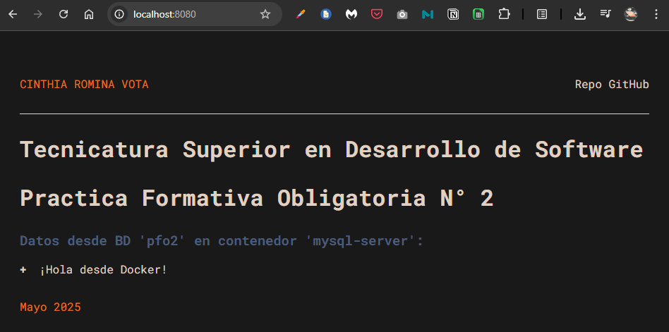

# Práctica Formativa Obligatoria N.º 2 - DevOps


**Nombre:** Cinthia Vota  
**Repositorio GitHub:** [TSDS.DevOps.PFO.02](https://github.com/VCinthia/TSDS.DevOps.PFO.02)  
**Imagen en Docker Hub:** [cinthiarvlab/php-web-pfo2](https://hub.docker.com/r/cinthiarvlab/php-web-pfo2)




## Descripción

Uso de Docker, imágenes y contenedores creandolos a través de imágenes de uso público. Conectarse a ese contenedor para dockerizar un proyecto web.

---

## Comandos ejecutados

### Crear contenedores Apache y MySQL
```bash
docker run -d --name php-web -p 8080:80 -v "/mnt/e/04.TSDS.5/05.DevOps/TSDS.DevOps.PFO.02":/var/www/html --network webnet php:8.2-apache

docker run -d --name mysql-server -e MYSQL_ROOT_PASSWORD=passx -p 3306:3306 mysql
```

### Conectar contenedores
```bash
docker network create webnet

docker network connect webnet apache-server
docker network connect webnet mysql-server
```

### Crear base de datos y tabla desde DBeaver
```sql
CREATE DATABASE pfo2;
USE pfo2;
CREATE TABLE mensajes (id INT AUTO_INCREMENT PRIMARY KEY, texto VARCHAR(255));
INSERT INTO mensajes (texto) VALUES ('¡Hola desde Docker!');
```

### Crear imagen personalizada
```bash
docker build -t php-web-pfo2 .

docker rm -f php-web

docker run -d --name php-web -p 8080:80 --network webnet php-web-pfo2
```

### Subir imagen a Docker Hub
```bash
docker tag php-web-pfo2 cinthiarvlab/php-web-pfo2
docker push cinthiarvlab/php-web-pfo2
```

### Usar `docker-compose`
Archivo `docker-compose.yml` agregado al repositorio para levantar servicios automáticamente.

```bash
docker-compose up -d
```

---

## Archivos incluidos

### `Dockerfile`
```Dockerfile
FROM php:8.2-apache

RUN apt-get update \
    && docker-php-ext-install mysqli

COPY . /var/www/html/
```

### `docker-compose.yml`
```yaml
version: '3.8'

services:
  mysql-server:
    image: mysql:8
    container_name: mysql-server
    environment:
      MYSQL_ROOT_PASSWORD: passx
      MYSQL_DATABASE: pfo2
    ports:
      - "3306:3306"
    networks:
      - pfo-net

  php-web:
    image: cinthiarvlab/php-web-pfo2
    container_name: php-web
    ports:
      - "8080:80"
    networks:
      - pfo-net

networks:
  pfo-net:
```

---

## Problemas y soluciones

- **`mysqli` not found:** Se resolvió creando una imagen personalizada con la extensión mysqli instalada desde `docker-php-ext-install`.
- **No se veían los cambios en localhost:** Se corrigió usando volúmenes y `docker build` + `docker run` nuevamente.

---

## Instrucciones para levantar el proyecto

1. Clonar el repositorio:

    ```bash
    git clone https://github.com/VCinthia/TSDS.DevOps.PFO.02
    cd TSDS.DevOps.PFO.02
    ```

2. Levantar los servicios con Docker Compose:  

    ```bash
    docker-compose up -d
    ```

3. Acceder en el navegador:  

    [🌐 http://localhost:8080](http://localhost:8080)
